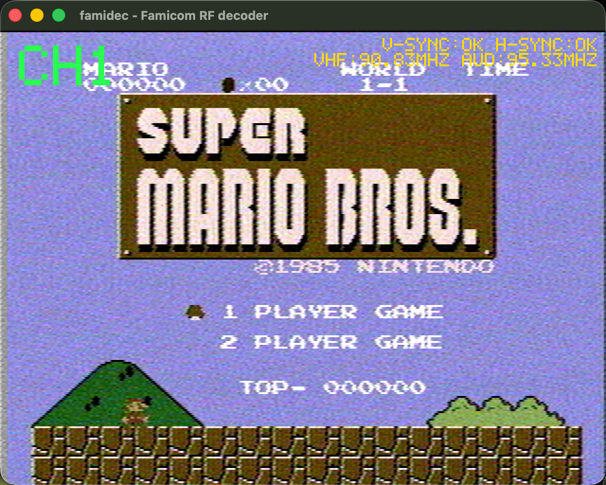

# famemu · famitv — NES through a real analog TV signal chain

Play NES games the way they actually looked in 1986: not with a "CRT filter",
but by **re-encoding the emulator's video into a genuine NTSC-J RF signal and
decoding it back** through a full software analog TV chain. The dot crawl,
chroma bleed, rainbow shimmer on fine patterns, soft edges — all of it *emerges*
from squeezing color video through one composite channel and band-splitting it
back, exactly like a real TV did. Nothing is faked with shaders.

```
NES ROM → Nestopia (libretro) → NTSC-J modulator → RF signal (int8 IQ)
        → mixer → band-limit → AM detect → sync/PLL → Y/C split → chroma demod
        → your screen (plus optional CRT beam/mask/glow simulation)
```

The same decode chain also works on **real hardware**: point a HackRF One at an
actual Famicom's RF output and watch it live (see
[Hardware mode](#hardware-mode-decode-a-real-famicom) below).

Built on [GOROman's `famicom-rf-hackrf-decoder`](https://github.com/GOROman/famicom-rf-hackrf-decoder)
(MIT) — the RF decoder at the heart of this project is his work (see
[Credits](#credits--license)).

## Quick start

```sh
brew install sdl2 cmake pkg-config        # macOS; Linux needs the same libs

# Nestopia libretro core (NES emulation), as a sibling checkout:
git clone https://github.com/libretro/nestopia ../third_party/nestopia
make -C ../third_party/nestopia/libretro -j4

# Play a ROM through the analog chain:
scripts/famitv.sh path/to/game.nes
```

`famitv.sh` configures, builds, and launches. Everything is plain C++20 +
SDL2 + CMake — no GNU Radio, no shader packs.

### Controls

| | |
|---|---|
| Gamepad (Switch Pro or any SDL controller) | d-pad / left stick, A, B, Start, Select (Back) |
| Keyboard | arrows, `X` = A, `Z` = B, Enter = Start, RShift = Select |
| `c` | color / grayscale |
| `q` / ESC | quit |

## The TV look, tunable

```sh
scripts/famitv.sh game.nes --noise 0.02 --scanlines 0.35   # antenna snow + scanlines
scripts/famitv.sh game.nes --crt                           # full CRT simulation
scripts/famitv.sh game.nes --bw 3.2e6                      # softer, narrower channel
```

| Flag | Effect |
|---|---|
| `--noise F` | channel noise → analog snow (try `0.02`) |
| `--scanlines F` | darken alternate lines, 0..1 |
| `--bw HZ` | channel bandwidth (lower = softer picture, default `4.3e6`) |
| `--sat F` / `--hue DEG` | color trims |
| `--generic` | plain RGB→NTSC re-encode instead of the real NES signal (below) |
| `--crt` | full CRT display simulation |
| `--crt-curve/-scan/-mask/-glow/-bright/-beam/-vig F` | CRT knobs: barrel curvature, scanline depth, aperture-grille mask, halation, brightness, beam width, vignette |
| `--dump DIR` | headless: run frames and write decoded BMPs (verification/CI) |

### The real NES composite signal (default)

The NES PPU never output RGB — each of its 64 colors *is* a specific chroma
phase and luma level on the composite wire. By default famitv reverse-maps the
emulator's RGB back to NES color indices and synthesizes **that** waveform
(Bisqwit's documented signal model), so NES color and its famous artifacts
emerge from the physics instead of being painted on. `--generic` switches to a
plain RGB→NTSC encode for comparison.

### CRT simulation (`--crt`)

A CPU reference implementation of the "screen" half of the look (the signal
half is the RF chain): barrel geometry → bilinear resample → scanline beam
profile → aperture-grille phosphor mask → halation/bloom → vignette → gamma.
Written to be ported 1:1 to a Metal fragment shader for the real-time app.

## No emulator? No hardware? — the loopback demo

`famitv_loopback` needs nothing but this repo: it draws an animated synthetic
scene (color bars, fine stripes, a scrolling "game"), pushes it through the
full modulate→decode chain, and writes the decoded frames as BMPs:

```sh
cmake -B build -DCMAKE_BUILD_TYPE=Release -DFAMITV_TOOLS_ONLY=ON
cmake --build build -j
./build/famitv_loopback out_dir
```

It's also the fastest way to *see* the artifacts: the 1-px stripes dot-crawl,
the color bars ring at the transitions, saturated edges bleed.

## Building by hand

```sh
cmake -B build -DCMAKE_BUILD_TYPE=Release
cmake --build build -j
ctest --test-dir build          # golden NTSC decode test
```

| Target | Needs | What it is |
|---|---|---|
| `famitv_play` | SDL2 + Nestopia checkout | the ROM player |
| `famitv_loopback` | nothing | synthetic loopback demo |
| `synth_ntsc` | nothing | golden test (color bars → decode → assert RGB) |
| `famidec` | libhackrf + SDL2 | live HackRF decoder (hardware mode) |

Missing libhackrf fails the configure loudly; pass `-DFAMITV_TOOLS_ONLY=ON`
to build without it (the launcher script does this automatically). The
Nestopia path can be overridden with `-DNESTOPIA_DIR=...`.

## Hardware mode: decode a real Famicom

The decode chain wasn't designed against emulator output — it was built to
receive an **actual Famicom's VHF RF** (NTSC-J) with a HackRF One, in real
time, with full NTSC color and FM intercarrier audio:



```sh
./build/famidec --channel 1 --spectrum    # find the real carrier first
./build/famidec --channel 1               # live (Japan VHF ch1, 91.25 MHz)
./build/famidec --freq 90.83e6            # real modulators drift — use the measured carrier
./build/famidec --input file --file cap.cs8 --loop   # decode a recording
```

Keys: `l`/`L` LNA ±8 dB, `g`/`G` VGA ±2 dB, `c` color/gray, `s` screenshot.
While unlocked the display free-runs and shows snow, like a real TV. Run
`--spectrum` first if you can't get sync; envelope detection tolerates
±100 kHz of carrier offset. Full option list: `./build/famidec --help`.

## How the chain works

```
input (HackRF 10 MSPS, or the famitv modulator)
  → complex DC blocker → NCO mixer (video carrier → 0 Hz)
  → 4.3 MHz complex LPF → AM detection (envelope or carrier-PLL)
  → AGC (sync-tip / back-porch → IRE) → sync separation + flywheel line PLL
  → Y/C band split (3.58 MHz BPF) → per-line burst phase → chroma QAM demod
  → YUV→RGB 640×480 (240p line-doubled) → triple buffer → SDL2
audio tap → −4.5 MHz mix → decimating FIR → FM discriminator → de-emphasis → SDL audio
```

The Famicom is not broadcast-compliant (non-interlaced 240p, chroma phase
advancing 120°/line, one short line per frame), so the decoder splits Y/C by
frequency band rather than a line comb, detects vsync as a long-pulse region,
and measures the color burst independently on every line. ~13× real-time
headroom at 10 MSPS on Apple Silicon.

The forward direction (famitv's modulator) is the exact inverse, sharing the
same constants — subcarrier and carrier phase run continuously across fields
like real hardware, with negative modulation (sync = 100% carrier).

## Repo map

```
src/dsp/            decode chain + ntsc_modulator.hpp + nes_signal.hpp (NES composite model) + crt.hpp
src/source, src/ui  HackRF input, SDL display/audio
tools/              famitv_play.cpp (ROM player), famitv_loopback.cpp (demo)
scripts/famitv.sh   build-and-play launcher
tests/              synth_ntsc golden test
docs/               audits, bug journal, distribution notes
```

## Credits / license

MIT — see [LICENSE](LICENSE).

- **[GOROman](https://github.com/GOROman/famicom-rf-hackrf-decoder)** built the
  original real-time HackRF Famicom RF decoder this project is founded on; his
  copyright and license are retained unchanged. 日本語のオリジナル解説は
  [README.ja.md](README.ja.md) にあります。
- The NES composite signal model follows
  [Bisqwit's public-domain documentation](https://wiki.nesdev.org/w/index.php/NTSC_video)
  on the NESdev wiki.
- famitv/famemu additions are contributed under the same MIT terms.

Receive-only where hardware is involved: it never transmits with the HackRF One.
